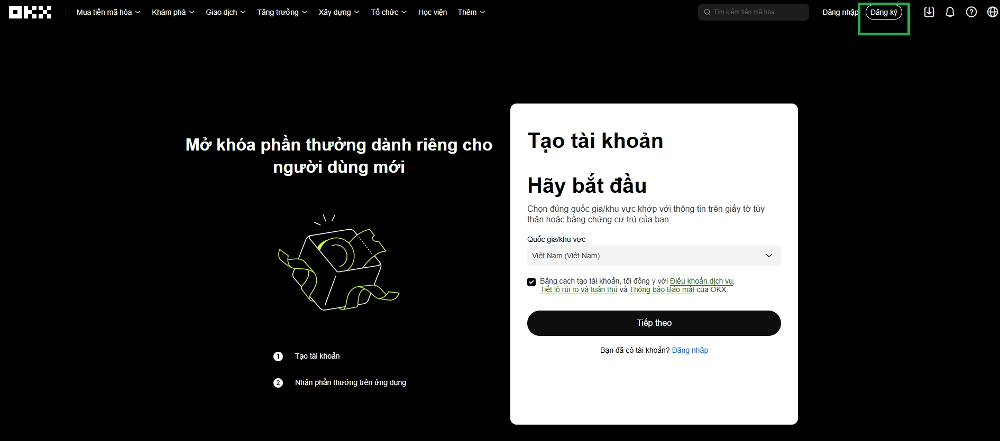
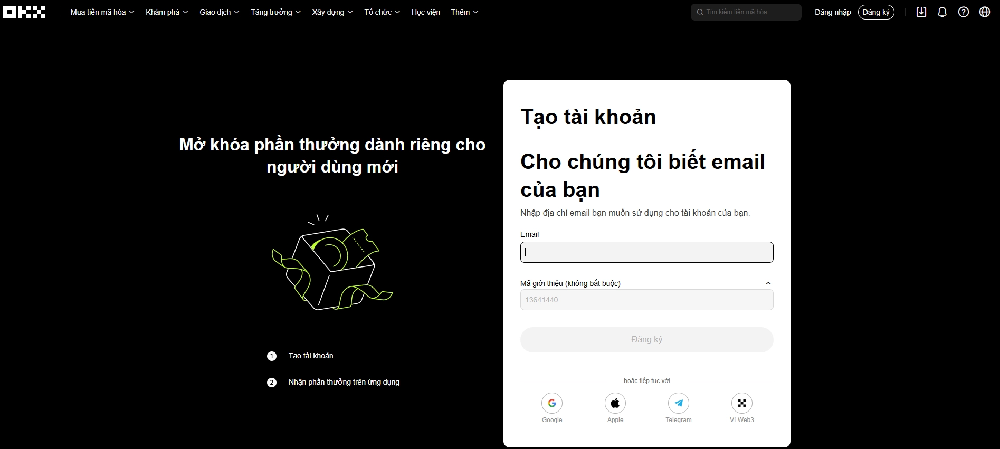
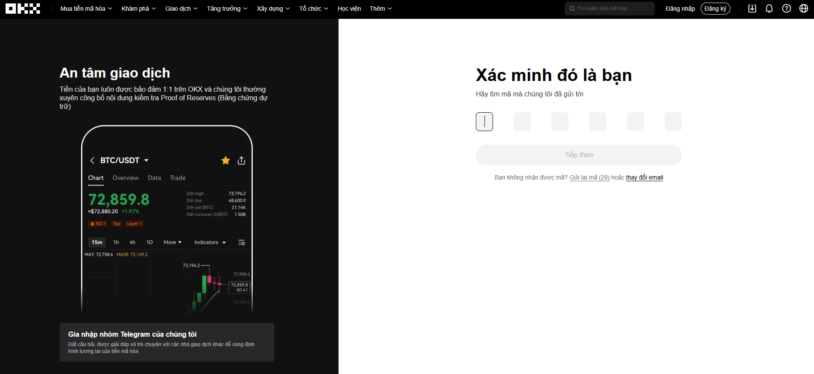
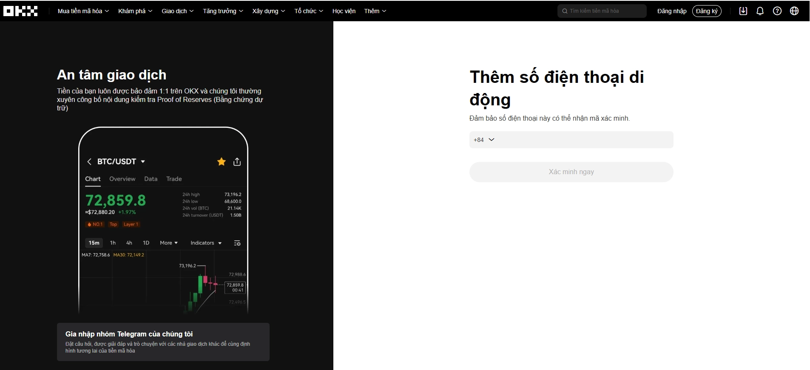
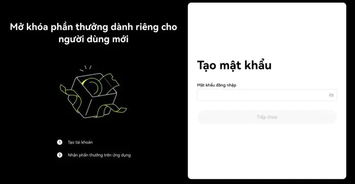
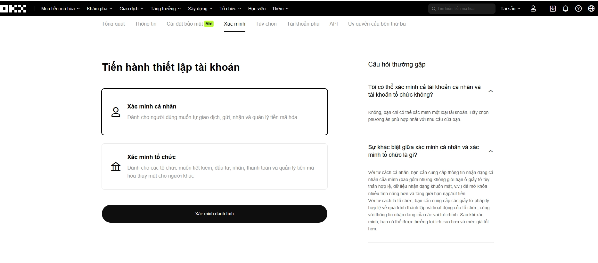
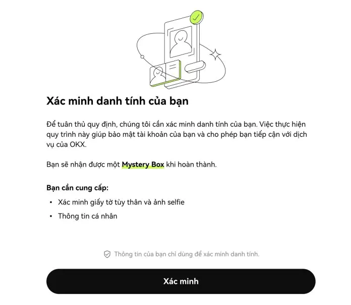
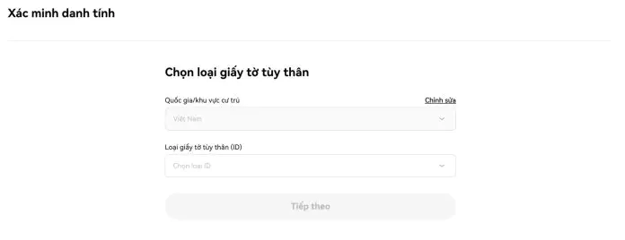
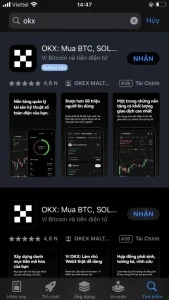
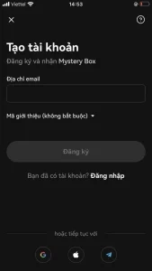

# Complete Guide to OKX Account Registration

Want to start trading crypto but stuck at the registration page? This guide walks you through creating an OKX account step-by-step—whether you're on desktop or mobile. From email verification to identity confirmation, everything's covered in plain language so you can start trading in minutes.

---

## What is OKX?

**OKX** (formerly OKEx) launched back in 2017 and has grown into one of the world's top crypto exchanges by trading volume. Based in Seychelles, it's not just another trading platform—it's a full ecosystem supporting spot trading, derivatives, staking, DeFi products, and Web3 tools.

Originally part of OK Group (which also includes OKCoin), OKX has carved out its own identity with bank-level security infrastructure including:

- Cold storage for the majority of user assets
- Multi-signature wallet protection
- Two-factor authentication (2FA)
- Real-time monitoring systems

### What Makes OKX Stand Out?

The platform packs an impressive range of features:

**Spot Trading** – Trade hundreds of tokens across countless pairs. Whether you're buying Bitcoin or exploring obscure altcoins, the liquidity's solid.

**Futures & Perpetual Contracts** – For those who want leverage, OKX offers derivative products with high multipliers. Not for the faint of heart, but the tools are there.

**Earn** – Your crypto doesn't have to sit idle. Stake it, save it, or throw it into farming pools to generate passive income.

**Web3 Wallet** – A non-custodial wallet supporting multiple chains including EVM networks, Solana, and Bitcoin. Your keys, your coins.

**NFT Marketplace** – Buy, sell, or mint NFTs directly within the platform. No need to jump to OpenSea every time.

**Copy Trading** – Not sure how to trade? Follow professional traders and automatically copy their moves. Learn by watching.

### User Experience

The iOS, Android, and web apps all feature clean, modern interfaces that don't overwhelm beginners. Vietnamese language support makes it especially convenient for Vietnamese traders. Customer support runs 24/7 with quick response times—helpful when you're troubleshooting at 2 AM.

---

## Quick Overview: Registration Steps

Here's the roadmap before we dive into details:

**Step 1:** Access OKX homepage or app to begin registration  
**Step 2:** Enter your email or phone number  
**Step 3:** Create a strong password  
**Step 4:** Enter the verification code sent to your email or phone  
**Step 5:** Complete identity verification

Simple enough? Let's break it down further.

---

## Registering on the OKX Website

### Getting Started

👉 [Click here to register your OKX account and unlock exclusive trading benefits](https://www.okx.com/join/47044926)

When you land on the homepage, you'll see a clean registration interface. Here's what to do:

Select **Vietnam** as your country (if that's where you're located). Tick the terms and conditions box, then hit **"Next"**.

### Email Registration

Enter your email address. Then click the **"Sign Up"** button.

Here's an important detail: If you didn't use the registration link above, manually enter the referral code **47044926** in the "Referral Code" field. This ensures you get the right account benefits and supports this guide.

### Email Verification

Check your inbox for the verification code. Enter it when prompted, then click **"Next"**.

### Phone Verification

Input your phone number and click **"Verify Now"**. Wait for the system to send you a verification code via SMS.

### Creating Your Password

Choose a strong password. Mix numbers, letters, and special characters to boost security. Don't use "password123" or your birthday—seriously, don't. Click **"Next"** when you're done.

### Identity Verification

Select **"Individual Verification"** and click **"Verify Identity"**.

### Submitting Your Documents

You'll need valid identification and a selfie. Fill in your personal information. OKX accepts:

- Driver's license
- Passport
- National ID card
- Citizen identification card

Have everything ready? Click **"Verify"**.

Choose your ID type and click **"Next"**.

A popup will appear asking you to scan a QR code. This launches the mobile verification process. Take a selfie and snap photos of your chosen ID document. If everything's clear and matches, the system verifies you instantly.

---

## Registering via Mobile App

OKX is available on both the App Store and Google Play. Just search for "OKX" and download the official app.

Open the app and tap **"Sign Up"**.

Enter your email and phone number. Don't forget to input the referral code **47044926** if you want to support this guide. The system sends verification codes to both your email and phone—same process as the website registration.

After creating your account, complete the identity verification. The steps mirror the website process outlined above.

---

## Why Choose OKX for Your Trading Needs?

Whether you're a complete beginner or an experienced trader, OKX offers the stability, features, and security to support your crypto journey. The registration process takes just minutes, identity verification is typically instant, and you'll have access to one of crypto's most comprehensive platforms. From simple spot trading to complex derivatives, from passive staking to active NFT collecting—it's all there waiting. 

👉 [Start your OKX journey now and experience seamless crypto trading](https://www.okx.com/join/47044926)
